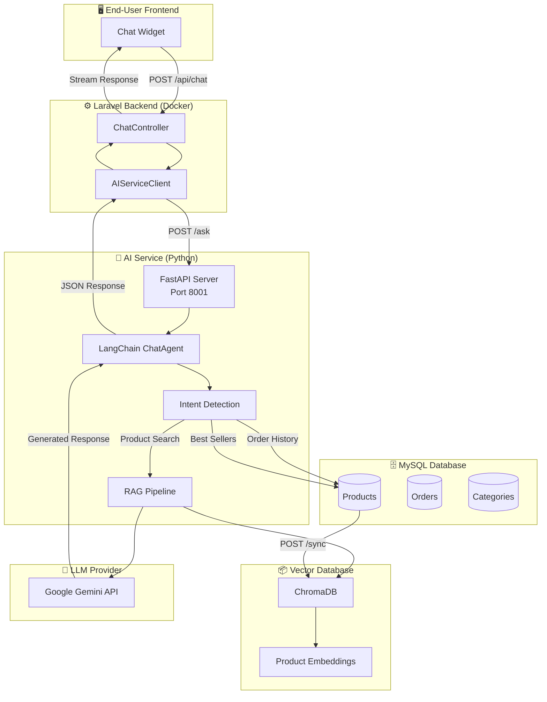
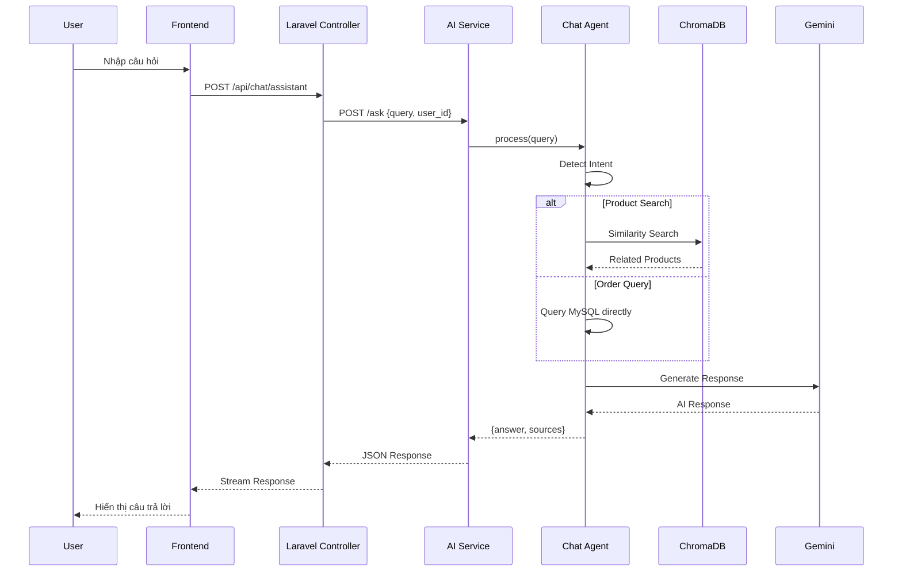
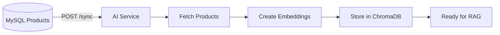

# AI Chatbot Service - Architecture Overview

## Kiến trúc hệ thống

Hệ thống chatbot AI sử dụng kiến trúc **RAG (Retrieval-Augmented Generation)** với FastAPI + LangChain + ChromaDB để tư vấn sản phẩm cho thuê.

---

## Luồng xử lý Chat

---

## Các thành phần chính

| Component  | Technology      | Port | Description          |
| ---------- | --------------- | ---- | -------------------- |
| Frontend   | Next.js         | 3000 | Chat UI cho end-user |
| Backend    | Laravel + Nginx | 8000 | API Gateway, Auth    |
| AI Service | FastAPI         | 8001 | LangChain + RAG      |
| Vector DB  | ChromaDB        | -    | Product embeddings   |
| Database   | MySQL           | 3306 | Products, Orders     |
| LLM        | Google Gemini   | -    | Text generation      |

---

## Intent Detection

AI Service tự động phát hiện ý định người dùng:

| Intent           | Trigger Keywords          | Data Source            |
| ---------------- | ------------------------- | ---------------------- |
| `product_search` | (default)                 | ChromaDB Vector Search |
| `order_history`  | "đơn hàng", "lịch sử mua" | MySQL Orders           |
| `order_status`   | "đơn #123", "trạng thái"  | MySQL Orders           |
| `best_sellers`   | "bán chạy", "phổ biến"    | MySQL Aggregation      |
| `check_stock`    | "tồn kho", "còn hàng"     | MySQL Products         |

---

## Data Sync Flow

