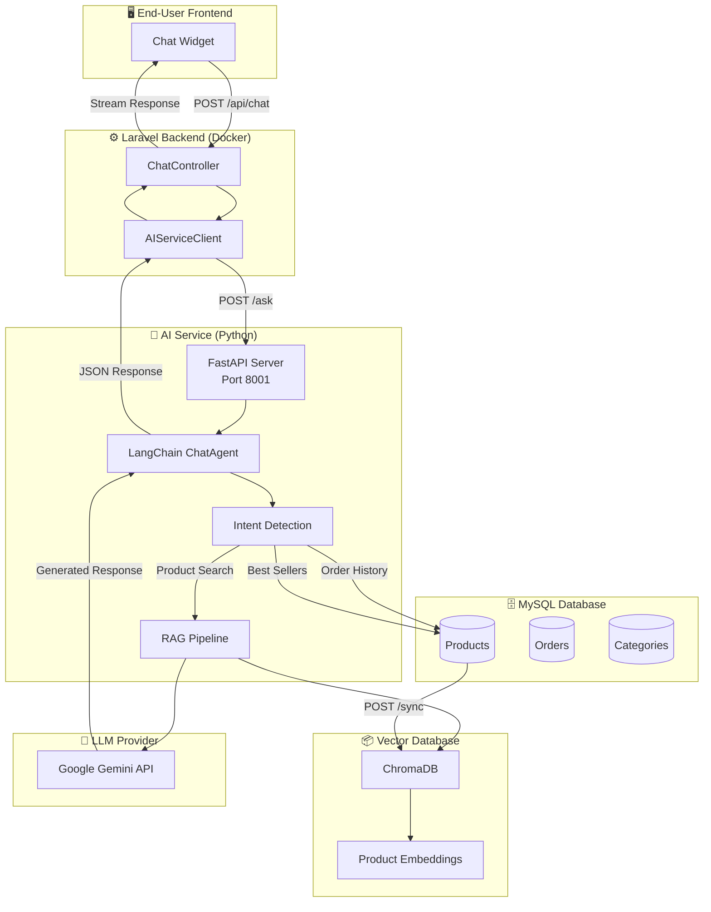
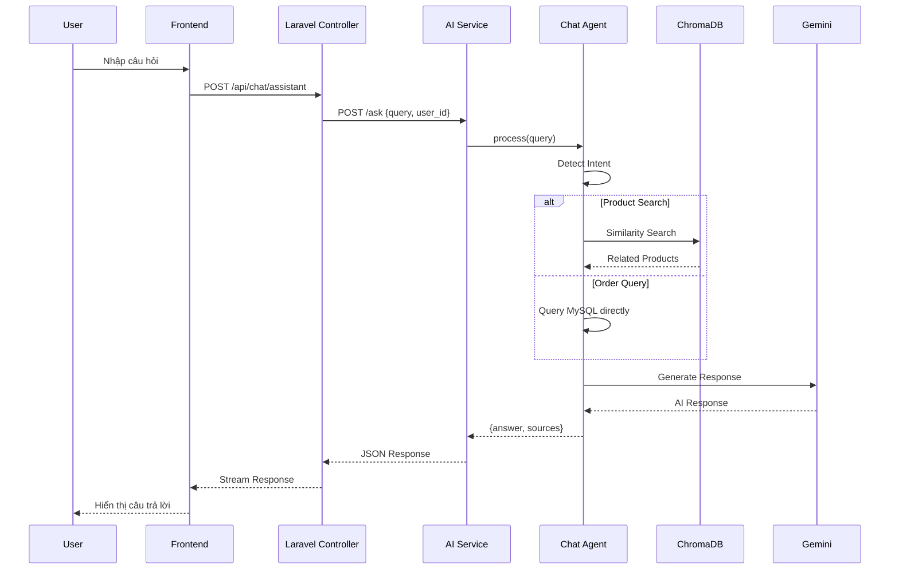
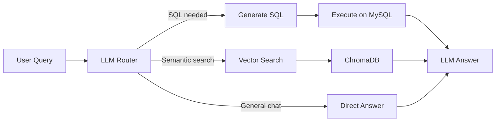
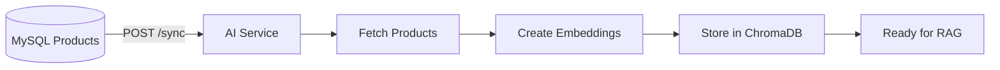

# AI Chatbot Service - Architecture Overview

## Kiến trúc hệ thống

Hệ thống chatbot AI sử dụng kiến trúc **RAG (Retrieval-Augmented Generation)** với FastAPI + LangChain + ChromaDB để tư vấn sản phẩm cho thuê.



---

## Luồng xử lý Chat



---

## Các thành phần chính

| Component  | Technology      | Port | Description          |
| ---------- | --------------- | ---- | -------------------- |
| Frontend   | Next.js         | 3000 | Chat UI cho end-user |
| Backend    | Laravel + Nginx | 8000 | API Gateway, Auth    |
| AI Service | FastAPI         | 8001 | LangChain + RAG      |
| Vector DB  | ChromaDB        | -    | Product embeddings   |
| Database   | MySQL           | 3306 | Products, Orders     |
| LLM        | Google Gemini   | -    | Text generation      |

---

## Chat Agent Modes

AI Service hỗ trợ 2 chế độ xử lý chat:

### 1. Smart Agent (Text-to-SQL) - Mặc định

**Cách hoạt động:** LLM tự động quyết định chiến lược xử lý dựa trên câu hỏi.



**Ưu điểm:**

- Linh hoạt, không cần code thêm cho query mới
- Xử lý được các câu hỏi phức tạp (filter, aggregate, sort)
- LLM hiểu ngữ cảnh tốt hơn regex

**Ví dụ queries được hỗ trợ tự động:**

- "Sản phẩm đắt nhất là gì?" → SQL: `ORDER BY price DESC LIMIT 1`
- "Có bao nhiêu sản phẩm?" → SQL: `SELECT COUNT(*)`
- "Sản phẩm giá từ 100k đến 500k" → SQL: `WHERE price BETWEEN ...`
- "Sản phẩm thuộc danh mục Âm thanh" → SQL: `JOIN categories`

### 2. Rule-based Agent (Legacy)

**Cách hoạt động:** Dùng regex để detect intent, sau đó gọi function tương ứng.

| Intent           | Trigger Keywords          | Data Source            |
| ---------------- | ------------------------- | ---------------------- |
| `product_search` | (default)                 | ChromaDB Vector Search |
| `order_history`  | "đơn hàng", "lịch sử mua" | MySQL Orders           |
| `order_status`   | "đơn #123", "trạng thái"  | MySQL Orders           |
| `best_sellers`   | "bán chạy", "phổ biến"    | MySQL Aggregation      |
| `check_stock`    | "tồn kho", "còn hàng"     | MySQL Products         |
| `most_expensive` | "đắt nhất", "giá cao"     | MySQL ORDER BY price   |
| `cheapest`       | "rẻ nhất", "giá thấp"     | MySQL ORDER BY price   |

**Ưu điểm:**

- Nhanh hơn (1 LLM call thay vì 2)
- Không tốn token cho routing

### API Request

```json
{
  "query": "Sản phẩm đắt nhất là gì?",
  "user_id": 123,
  "use_smart_agent": true // true = Text-to-SQL, false = Rule-based
}
```

---

## Data Sync Flow


