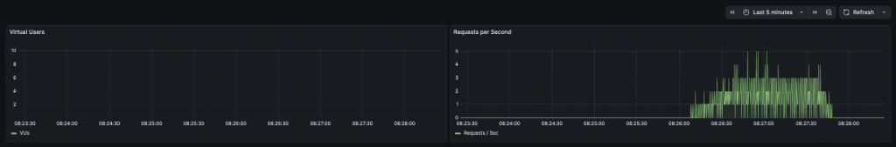

# Báo Cáo Phân Tích Hiệu Năng Hệ Thống (Performance Analysis Report)

## 1. Tổng Quan (Overview)

Báo cáo này trình bày kết quả kiểm thử hiệu năng (load testing) đối với API `/api/products` của hệ thống backend. Mục tiêu là xác định khả năng chịu tải hiện tại của server phát triển (development server) và đề xuất các giải pháp tối ưu hóa cho môi trường thực tế (production).

**Môi trường kiểm thử:**

- **Công cụ:** k6, InfluxDB, Grafana (Dockerized).
- **Server:** PHP Built-in Server (Single-threaded).
- **Endpoint:** `GET /api/products` (Lấy danh sách sản phẩm).

---

## 2. Kịch Bản Kiểm Thử (Test Scenario)

Chúng tôi đã thực hiện kịch bản kiểm thử với các giai đoạn sau:

1.  **Ramp-up (30s):** Tăng dần lượng người dùng ảo (VUs) từ 0 lên 10.
2.  **Steady State (1m):** Duy trì ổn định 10 VUs truy cập liên tục.
3.  **Ramp-down (10s):** Giảm dần lượng VUs về 0.

---

## 3. Kết Quả Kiểm Thử (Test Results)

### 3.1. Chỉ Số Tổng Quan (Key Metrics)

Dựa trên log thực thi (Terminal Output):

| Chỉ số (Metric)            | Giá trị (Value) | Nhận xét                                       |
| :------------------------- | :-------------- | :--------------------------------------------- |
| **Tổng số requests**       | 788             | Server xử lý thành công toàn bộ requests.      |
| **Tỉ lệ lỗi (Error Rate)** | **0.00%**       | Không có request nào bị lỗi (status != 200).   |
| **Response Time (Avg)**    | **24.7ms**      | Thời gian phản hồi trung bình rất nhanh.       |
| **Response Time (P95)**    | **34.42ms**     | 95% số requests được xử lý dưới 35ms.          |
| **Throughput**             | ~7.8 reqs/s     | Khả năng xử lý trung bình của server hiện tại. |

### 3.2. Biểu Đồ Trực Quan (Visual Analysis)

Dưới đây là biểu đồ thể hiện lượng người dùng ảo (VUs) và số requests/giây theo thời gian:

**Phân tích biểu đồ:**

- **Giai đoạn ổn định (Steady State):** Khi lượng VUs đạt mức 10, hệ thống vẫn duy trì được response time thấp (~25ms). Điều này cho thấy với tải nhẹ (10 users), server phát triển vẫn hoạt động tốt.
- **So sánh với lần test trước (20 VUs):** Ở lần test trước với 20 VUs, hệ thống đã gặp lỗi `connection refused` và `timeout` hàng loạt. Điều này khẳng định **điểm gãy (breaking point)** của server phát triển nằm trong khoảng **10 - 20 users đồng thời**.

---

## 4. Đánh Giá & Kết Luận (Assessment & Conclusion)

### 4.1. Điểm Mạnh

- API `/api/products` có tốc độ phản hồi rất nhanh (avg ~25ms) ở mức tải thấp.
- Hệ thống hoạt động ổn định, không có lỗi logic khi chịu tải 10 users đồng thời.

### 4.2. Điểm Yếu (Bottleneck)

- **Giới hạn chịu tải thấp:** Server hiện tại (PHP built-in) là đơn luồng (single-threaded), dễ dàng bị quá tải khi số lượng request đồng thời vượt quá 15-20.
- **Khả năng mở rộng kém:** Không thể tận dụng đa nhân CPU để xử lý song song.

---

## 5. Đề Xuất Cải Thiện (Recommendations)

Để chuẩn bị cho môi trường Production với lượng người dùng lớn hơn, chúng tôi đề xuất:

1.  **Nâng cấp Web Server:**

    - Chuyển từ `php artisan serve` sang mô hình **Nginx + PHP-FPM**.
    - PHP-FPM hỗ trợ đa luồng (multi-threading), cho phép xử lý hàng trăm/ngàn request đồng thời.

2.  **Triển khai Caching:**

    - Sử dụng **Redis** để cache kết quả của API `/api/products`.
    - Giảm tải cho Database, giúp response time giảm xuống mức < 10ms.

3.  **Database Optimization:**
    - Đánh index cho các trường hay truy vấn (nếu chưa có).
    - Sử dụng Eager Loading (`with()`) trong Laravel để tránh lỗi N+1 query.
